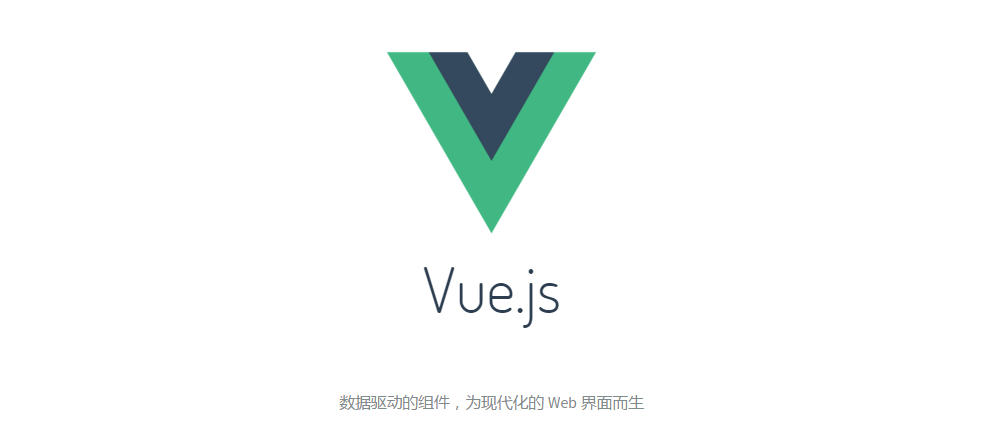
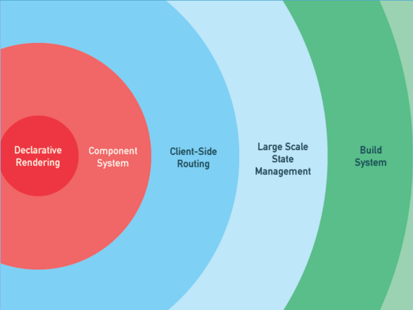
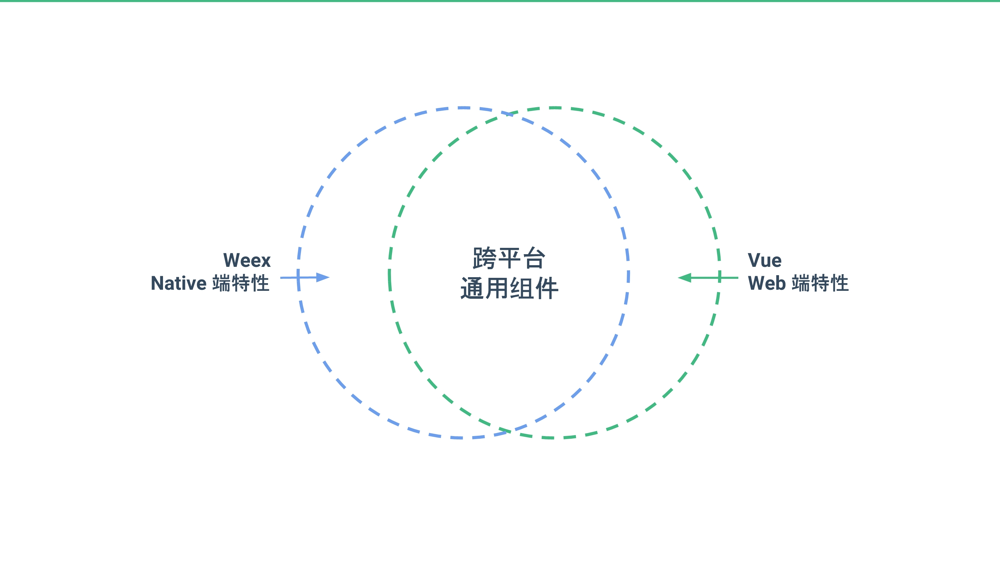
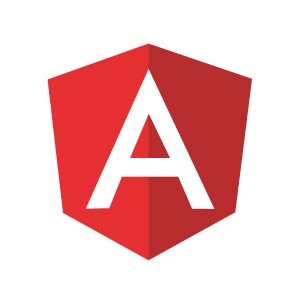
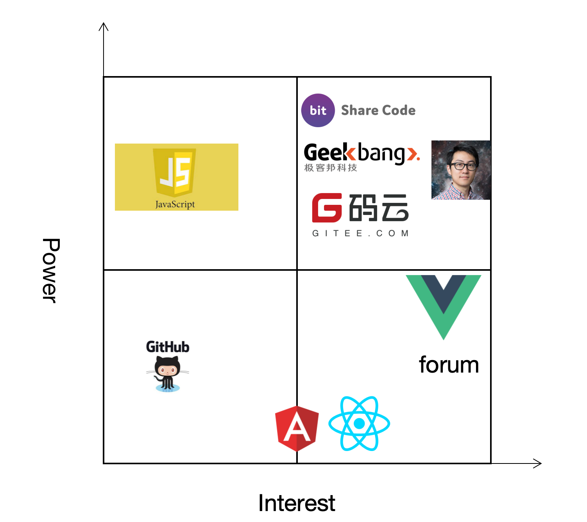
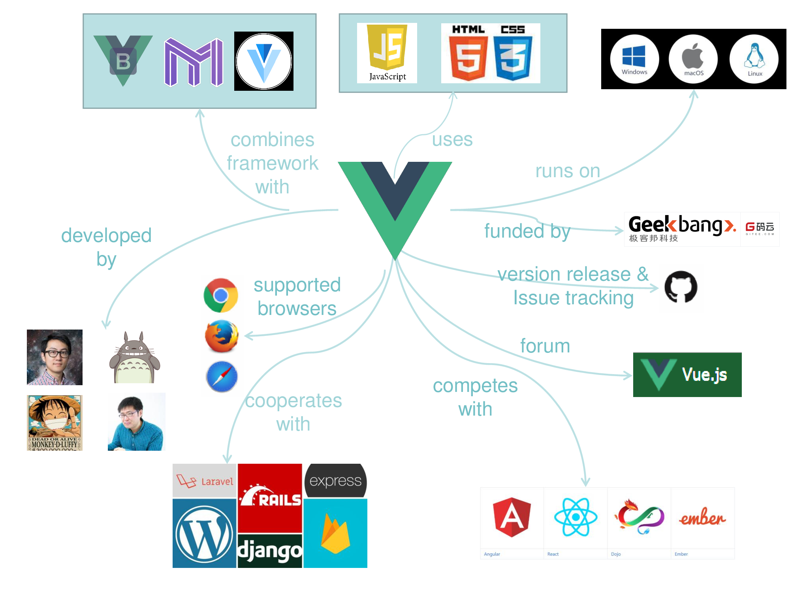
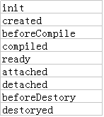
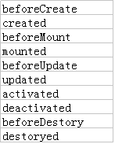

Vue - The Progressive Front-end Framework
===

​                                                                                           ——***By [Evan You](https://github.com/yyx990803)***

***1.Abstract***
---

  Vue (pronounced /vjuː/, like **view**) is a **progressive framework** for building user interfaces. Unlike other monolithic frameworks, Vue is **designed from the ground up to be incrementally adoptable**. The core library is focused on the view layer only, and is easy to pick up and integrate with other libraries or existing projects. On the other hand, Vue is also perfectly capable of powering sophisticated Single-Page Applications when used in combination with [modern tooling](https://vuejs.org/v2/guide/single-file-components.html) and [supporting libraries](https://github.com/vuejs/awesome-vue#components--libraries).

***2.Introduction***
---
In Vue, at the very beginning, you do not have to know everything about it. That is to say, you gradually learn more about Vue if there is a need for you to build  a more complex project. Vue.js gives you sufficient options, advocates fewer requirements and allows developers to begin coding quickly, adding more features as per project needs.

Also, you may get confused about what incrementally adoptable is. According to Evan You, the Vue.js creator, described his framework, ***“Vue tries to pick the middle ground where the core is still exposed as a very minimal feature set, but we also offer these incrementally adoptable pieces, like a routing solution, a state management solution, a build toolchain, and the CLI.”*** 

 As the picture has shown below, we may come across such situations:

1. Fist Stage: simply use the convenience of Vue.js to substitute for some functions in Jquery or JS. 
2. Second Stage: use render to generate all the HTML DOM by Vue.js or multiple component share some common state.
3. Third Stage: if the front-end routing is needed, we can use **vue-router** to import such tool and allocate different responsibilities.
4. Fourth Stage: when the project comes to a large scale, **vuex** is a reliable state management pattern + library to help us to handle with it.
5. Fifth Stage: to optimize your websites or to improve their ranking in SEO, try to build a Server-Side render architecture.

<!--image from the tutorial video-->

As an front-end development tool, Vue combines both servers and clients by the JS framework that it defines in the core module. On the server side, Weex files generate JSBundles to be deployed. On the client side, Vue organize those JSBundles as components to be analysed by **JSCore/V8**, which will make Android and iOS RenderEngine able to load those dynamic JS Frameworks. And for H5RenderEngine, there is no need to callJS of JSCore/V8 to load JSBundles, which can be directly accessed. In this way, Vue shows an incredible efficiency, robustness and simplicity in UI development, since it provides very powerful and convenient API for developers to build cross platform architectures.

In a word, with the help of Vue, we can build our project depending on our own needs in the most efficient and lightweight way.

***3.Stakeholders***
---

### What is a stakeholder?

Stakeholder is  a member of the **"groups without whose support the organization would cease to exist."** or **"A person, group or organization that has interest or concern in an organization. "**

And in this project, we may say those companies using and supporting Vue or those developers who contribute to Vue.

### Developers

 Here are top three coders among all the 194 contributors:

1. @[Evan You](https://github.com/yyx990803) 2068 commits
2. @[Hanks](https://github.com/Hanks10100) 47 commits
3. @[chengchao](https://github.com/defcc) 37 commits

Developers aim at making Vue.js better.

### Special Sponsors

There are 2 ways to support Vue.js. Funds donated via Patreon go directly to support Evan You, the creator of Vue.js, for him to work on it full-time.Funds donated via OpenCollective are managed with transparent expenses and will be used for compensating work and expenses for core team members or sponsoring community events. 

### Platinum Sponsors

|  |  |  |  |
| ------------------------------------------------------------ | ------------------------------------------------------------ | ------------------------------------------------------------ | ------------------------------------------------------------ |
|                                                              |                                                              |                                                              |                                                              |
|  |                                                              |                                                              |                                                              |
|                                                              |                                                              |                                                              |                                                              |

### Platinum Sponsors (China)

|  |  |
| ------------------------------------------------------------ | ------------------------------------------------------------ |
|                                                              |                                                              |

### Gold Sponsors

|  |  |  |  |  |  |
| ------------------------------------------------------------ | ------------------------------------------------------------ | ------------------------------------------------------------ | ------------------------------------------------------------ | ------------------------------------------------------------ | ------------------------------------------------------------ |
|                                                              |                                                              |                                                              |                                                              |                                                              |                                                              |
|  |  |  |  |  |  |
|                                                              |                                                              |                                                              |                                                              |                                                              |                                                              |
|  |  |  |  |  |  |
|                                                              |                                                              |                                                              |                                                              |                                                              |                                                              |
|  |  |  |  |  |  |
|                                                              |                                                              |                                                              |                                                              |                                                              |                                                              |

### Competitors 

|                |               |          |                 |
| --------------------------------------------- | ------------------------------------------ | ------------------------------------ | -------------------------------------------- |
| [Angular](https://github.com/angular/angular) | [React](https://github.com/facebook/react) | [Dojo](https://github.com/dojo/dojo) | [Ember](https://github.com/emberjs/ember.js) |

- Angular: prevalent and competitive in market, with abundant tools.
- React: relatively simple and concentrated, easy to learn.
- Dojo: focus on interact, fill the vacancy in other frameworks.
- Ember: a somewhat stubborn framework, nearly one way to create application. Backward Compatible.
- Vue.js: progressive framework, concise and reasonable, easy to comprehend and build.

### Power-Interest Grid

A stakeholders matrix shows which strategies to use. In this project, as you can see, the developer, Evan You and his team has the most closest relation to Vue.js. In addition, his work needs fund so that some companies support and use it closely. Also, users can discuss on the forum whenever they have some problems. Since Vue.js is based on JavaScript and published on GitHub, that is why I put them into this grid. As for other front-end framework like React, they are competitors so they keep informed of what Vue.js is going on.

***4.ContextView***
---
### What is a ContextView?
It describes the relationships, dependencies, and interactions between the system and its environment (the people, systems, and external entities with which it interacts). Many architecture descriptions focus on views that model the system’s internal structures, data elements, interactions, and operation. Architects tend to assume that the “outward-facing” information — the system’s runtime context, its scope and requirements, and so forth – is clearly and unambiguously defined elsewhere. However, you often need to include a definition of the system’s context as part of your architectural description.

In order to display the basic relationship between Vue.js outside templates, here is the Context View about Vue.js framework, drawn by ourselves：

### Brief Explaination about the figure
As a progressive javascript framework, Vue.js is supposed to use javascript, html, css language to achieve the visual effect. Due to the markup language, this framework can be run on Windows, Mac OS, Linux to display the front end, which makes it become very popular in the developer. You can see from the Vue.js readme.md to check that there are many supporters, couple of them in China are Greekbang and GITEE.COM, just because the main developer Evan You is a ethnic Chinese. Also the Chinese language support in the forum is very well. There are many learners and developers in the formal forum to answer the issues and come up with some ideas. Vue.js has lots of combine framework, like the BV, the Muse UI, the Vuetify.js and so on. They improve the Vue.js performance and add some additional function towards the framework.

***5.Development View***
---
The development viewpoint describes the architecture that supports the software development process. It aims to provide an overview of the structure of Vue.js for stakeholders like production engineers, software developers and testers. This viewpoints concerns about module organization, conmmon processing,  standardization of design and testing, instrument and codeline organization.

### Module Organization
Vue framework is a very young open-source project built by Evan You, a 19-year-old awsome boy from Google. Over the the past 4 years, many developers have joined this project to make it more powerful and easy for UI designers to use. From the first version Vue1.0 to recent Vue2.0, the organization of Vue has changed several times, but the core module stays the same. The module organization can be simply divided into 2 parts: Client and Server. The following figure shows the basic architecture.

As we have mentioned before, Vue combines the server and client by JS Framework generated by Weex Files, then Vue encalpsulated them as components to establish a new web project. With the help of corresponding renderEngine, those components are loaded by the client machines and rendered to show expected effects.

### Codeline Models
This section will explain how the directory of Vue.js is structured and coordinated via configuration management and how it is built and tested regularly. The overall structure of the directory hierarchy of Vue.js is organized as follows.

**Table-** *source code structure of Vue.js*

| Directory | Descriptions |
|-|-|
|scripts|contains build-related scripts and configuration files.|
|dist|contains built files for distribution. Note this directory is only updated when a release happens; they do not reflect the latest changes in development branches.|
|flow|contains type declarations for Flow. These declarations are loaded globally and you will see them used in type annotations in normal source code.|
|packages|contains `vue-server-renderer` and `vue-template-compiler`, which are distributed as separate NPM packages. They are automatically generated from the source code and always have the same version with the main vue package.|
|test|contains all tests. The unit tests are written with Jasmine and run with Karma. The e2e tests are written for and run with Nightwatch.js.|
|src|contains the source code, obviously. The codebase is written in ES2015 with Flow type annotations.|
||so|kj|
|server|contains code related to server-side rendering.
|platforms|contains platform-specific code. Entry files for dist builds are located in their respective platform directory.Each platform module contains three parts: `compiler`, `runtime` and `server`, corresponding to the three directories above. Each part contains platform-specific modules/utilities which are then imported and injected to the core counterparts in platform-specific entry files. For example, the code implementing the logic behind `v-bind:class` is in `platforms/web/runtime/modules/class.js` - which is imported in `entries/web-runtime.js` and used to create the browser-specific vdom patching function.|
|sfc|contains single-file component (`*.vue` files) parsing logic. This is used in the `vue-template-compiler` package.|
|shared|contains utilities shared across the entire codebase.|
|types|contains TypeScript type definitions|

Here are the subdirectories of `/src`

**Table-** *source code structure of Vue/src*

| Directory | File | Description |
| - | - | - |
|compiler|| contains code for the template-to-render-function compiler|
||parser|converts template strings to element ASTs|
||optimizer.js|detects static trees for vdom render optimization|
||codegen|generate render function code from element ASTs|
|core||contains universal, platform-agnostic runtime code.|
||observer|contains code related to the reactivity system.|
||vdom|contains code related to vdom element creation and patching.|
||instance| contains Vue instance constructor and prototype methods.|
||global-api| as the name suggests.|
||components|universal abstract components. Currently keep-alive is the only one.|

### Concurrency Viewpoint
The concurrency viewpoint describes the concurrency structure of the system, mapping functional elements to concurrency units to clearly identify the parts of the system that can execute concurrently, and shows how this is coordinated and controlled.This involves defining the parts of the system that can run at the same time and how this is controlled (e.g., defining how the system’s functional elements are packaged into operating system processes and how the processes coordinate their execution). It is depicted via system-level concurrency modesl and state models.

**Figure-** *operating mechanism diagram of Vue.js*

When we create a new Vue() in main.js, Vue will call the constructor's _init() method, which is defined in the initMixin() method of `core / instance / index.js` .
A series of initialization settings are made to the current vm instance in the _init() method. The data/props is reconciled when the state method initState(vm) is initialized. This is to set the getter/setter to the object that needs to be responsive by the Object.defineProperty() method. Collection), to achieve the purpose of data changes to drive view changes.

Finally, check if there is an el attribute on vm.\$options, and if so, use the vm.\$mount method to mount vm to form a connection between the data layer and the view layer. This is why you need to manually vm.$mount('#app') if you don't provide the el option.

We see that the created hook is called before the $mount is mounted, so we can't manipulate the DOM until the created hook fires, because it hasn't been rendered to the DOM yet.

As we all know, vue.js is a framework based on MVVC model.

MVVM is divided into three parts: M (Model, model layer), V (View, view layer), VM (ViewModel, V and M connected bridge, can also be seen as a controller)
1. M: model layer, mainly responsible for business data related;
2. V: view layer, as the name suggests, responsible for view correlation, which is subdivided into html and css layer;
3. VM: V and M communication bridge, responsible for monitoring M or V modification, is the key to achieve two-way binding of MVVM;

ViewModel is the core of Vue.js, it is a Vue instance. A Vue instance acts on an HTML element. This element can be either the `<body>` element of HTML or an element with an `<id>` specified.
We see the DOM Listeners and Data Bindings in the above diagram as two tools, which are the key to achieving two-way binding.
From the View side, the DOM Listeners tool in the ViewModel will help us monitor the changes in the DOM elements on the page, and if there are changes, change the data in the Model;
From the Model side, when we update the data in the Model, the Data Bindings tool will help us update the DOM elements in the page.

It has been learned that vue is data binding through data hijacking. The most core method is to implement hijacking of attributes through Object.defineProperty(), to achieve the purpose of monitoring data changes, to achieve two-way binding of mvvm. To determine, you must implement the following:
1. Implement a data listener Observer that can listen to all properties of the data object. If there is a change, you can get the latest value and notify the subscriber 
2.  Implement an instruction parser Compile. Scan and parse the instructions of each element node, replace the data according to the instruction template, and bind the corresponding update function 
3. implement a Watcher, as a bridge connecting Observer and Compile, can subscribe to and receive notification of each attribute change , execute the corresponding callback function bound by the instruction, thereby updating the view 
4. mvvm entry function, and integrating the above three

## ***6. Functional View***
---
## Overview about Vue.js ##
As a progressive framwork about Vue.js, it can be divided into several parts. The source code is mainly about **Declarative Rendering**, **Component System**, **Client-Side Routing**. Also, there are many frameworks(like vuex) based on the Vue core source code, making some extend implements. These outside framework can be divided into **Large Scale State Management**, **Build System**.

> When compared to other frameworks, vue.js has its own pros and cons. The main advantage is that it is very light weight and easy to use. vue.js doses score higher in some benchmarks when comes to performance. vue.js offers us to build reactive interfaces. It also provides a large set of directives. Data binding, template logic, event handling and much more.
> 
> 25+ Best Vue.Js Frameworks:[https://cssauthor.com/vuejs-frameworks/](https://cssauthor.com/vuejs-frameworks/)

### Declarative Rendering ###

>Originally, the light weight framework used to adopt DOM component to achieve the rendering. But there are some problem with the DOM:
>
1.  Re-rendering entire chunks of DOM is expensive and disruptive
2.  Imperatively keeping the DOM in sync with the state is tedious and error-prone

The following picture show the specific details about how the rendering flow works. In fact, up to the Vue.js 2.0 version, it use the Declarative & Reactive Rendering to implement the visual effect. To be more specific, the State component receive the information(request) from the User Input, and then render the corresponding View component. View in this way is just a declarative mapping from the state. However, it can interact as the front end with the User and pass the reactive request to the back end again.
 

Besides, the Vue.js provides us the API to achieve the server-side rendering, using renderToString method or renderToStream method. Both of them are written in the ./dist/vue.common.js, you can check it and even modify it as you want.

### Component System ###

Most Apps UIs can be broken down into components. Every component is responsible for managing a piece of DOM. Therefore, the entire UI can be abstracted into a tree of components. Between each component, there is a communication mechanism, the child compoenent use **events out** to emit the events, and the parent component use **props in** to pass props toward the child. 

Here is a simple example of Todo demo using components

### Client-Side Routing ###

This function is implemented by the [vue-router](https://github.com/vuejs/vue-router). Vue-router is the official router for Vue.js. It deeply integrates with Vue.js core to make building Single Page Applications with Vue.js a breeze. Features include:

- Nested route/view mapping
- Modular, component-based router configuration
- Route params, query, wildcards
- View transition effects powered by Vue.js' transition system
- Fine-grained navigation control
- Links with automatic active CSS classes
- HTML5 history mode or hash mode, with auto-fallback in IE9
- Customizable Scroll Behavior

### Large Scale State Management ###

Here we use [Vuex](https://github.com/vuejs/vuex) to manage the large scale state. What is Vuex? Vuex is a state management pattern + library for Vue.js applications. It serves as a centralized store for all the components in an application, with rules ensuring that the state can only be mutated in a predictable fashion. It also integrates with Vue's official devtools extension to provide advanced features such as zero-config time-travel debugging and state snapshot export / import.

Here is a simple example in the document to show the State Management:

It is a self-contained app with the following parts:

The state, which is the source of truth that drives our app;
The view, which is just a declarative mapping of the state;
The actions, which are the possible ways the state could change in reaction to user inputs from the view.
This is an extremely simple representation of the concept of "one-way data flow":

The following picture the behind logic about how the entire State Management works:

### Build System ###

The following command show how to install the build system:

    npm install -g vue-cli
	vue init webpack-simple my-app
	cd my-app
	npm install
	npm run dev

As for the single file vue components, it contains several characters:

- Imported as a ES2015 module (thus easily testable)
- Collocation of Template, Logic & Style
- Just use what you already know: HTML, CSS & JavaScript
- Embedded pre-processor support: seamlessly use Babel, SASS or even Pug in the same file
- Hot-reload out of the box
- Component-scoped CSS with a single attribute

After we run the Vue.js program in the local server, we can use the outside software to make supportions toward the Vue.js project. Like the Official Chrome, it provides the DevTools Extension for developer to see the detail content and reaction state in Vue.js:

## ***7. Technical Debt***

Technical debt (AKA **design debt** or **code debt**) is a concept in software development that reflects the implied cost of additional rework caused by choosing an easy solution now instead of using a better approach that would take longer. But technical debt is not necessarily a bad thing, and sometimes it can move projects foward.

And here are some common causes of technical debt including:

- Insufficient up-front definition, where requirements are still being defined during development, development starts before any design takes place. This is done to save time but often has to be reworked later.
- Lack of process or understanding, where businesses are blind to the concept of technical debt, and make decisions without considering the implications.
- ...

Nothing is perfect, and there are always heated debates that which framework is the best one for developers and so on. Vue.js and other front-end frameworks are also without exception to arouse the discussion. Some users pointed out that, although Vue.js has lots of advantages such as reactivity, high availability, fast speed, light-weighted, good scalability etc., it does disappoint them in some ways. For example, its component boilerplate is not so satisfying, some codes can be more simplified. What's more, as I mentioned before, Vuex is a state management pattern for Vue.js, but its ambiguity in architecture really confused users, they do not know where the codes belong to. Ultimately, even Vue.js has the most detailed official docs, its lacking advanced or higher level tutorials or docs or books about it.

For example, the lifecycle of instance of Vue has changed a lot from Vue1.0 to Vue2.0, and here is the difference:

What I've talked about is not the comprehensive questions Vue.js has. But Evan You and other developers are working for the project to promote it. Vue.js has established its [forum](https://forum.vuejs.org) for those from all over the world using Vue.js. Additionally, Evan You has issued the Vue 3.0 version and published the Vue CLI 3.0 version with important updates. Vue.js is on its way to be a better framework.

## ***8. Evolution Perspective***

Even if we have emphasized a lot about the magic power of Vue framework, we can't ignore it that vue still has many fields to be improved. As a new comming developing technic, in order to chase up with other mature framework like ReactNative, Vue has created the official technical proposal such as Vuex and VueRouter, which is supposed to be a good way. However, if you want to search for substitution of Vuex and VueRouter as your framework, you will find it difficult to seek out a result which updates frequently with completed documents. All of Vue projects on the markets aims at front-end UI, and other types of projects are in a very small number. So maybe in the future, Vue can also make some improvement on Non-UI components to diversify its functions.

Another pressing problem is the education process. Vue doesn't lack of textbooks for beginners, but high-level developing textbooks and documents are desperately in need.
Since Vue is very flexible, to achieve the same requirement, developers can have a lot of kinds of design patterns, which make projects hard to maintain. If vue can define more strict grammer, the maintaining section can be easier to carry on.

Finally and most importantly, Vue lacks of IDE supported on the market. Eclipse and IEDA can't run vue projects without install many complex components of Node.js and Vue framework, which makes the developing for beginners hard to carry on. In the future, we are looking forward to see that Vue framework can be accepted by more and more IDE tools and plays an important role in Web and UI design.

