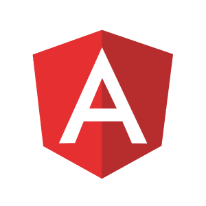

Vue - The Progressive Front-end Framework
===

​                                                                                           ——***By [Evan You](https://github.com/yyx990803)***

***1.Abstract***
---

  Vue (pronounced /vjuː/, like **view**) is a **progressive framework** for building user interfaces. Unlike other monolithic frameworks, Vue is **designed from the ground up to be incrementally adoptable**. The core library is focused on the view layer only, and is easy to pick up and integrate with other libraries or existing projects. On the other hand, Vue is also perfectly capable of powering sophisticated Single-Page Applications when used in combination with [modern tooling](https://vuejs.org/v2/guide/single-file-components.html) and [supporting libraries](https://github.com/vuejs/awesome-vue#components--libraries).

***2.Introduction***
---
In Vue, at the very beginning, you do not have to know everything about it. That is to say, you gradually learn more about Vue if there is a need for you to build  a more complex project. Vue.js gives you sufficient options, advocates fewer requirements and allows developers to begin coding quickly, adding more features as per project needs.

Also, you may get confused about what incrementally adoptable is. According to Evan You, the Vue.js creator, described his framework, ***“Vue tries to pick the middle ground where the core is still exposed as a very minimal feature set, but we also offer these incrementally adoptable pieces, like a routing solution, a state management solution, a build toolchain, and the CLI.”*** 

 As the picture has shown below, we may come across such situations:

1. Fist Stage: simply use the convenience of Vue.js to substitute for some functions in Jquery or JS. 
2. Second Stage: use render to generate all the HTML DOM by Vue.js or multiple component share some common state.
3. Third Stage: if the front-end routing is needed, we can use **vue-router** to import such tool and allocate different responsibilities.
4. Fourth Stage: when the project comes to a large scale, **vuex** is a reliable state management pattern + library to help us to handle with it.
5. Fifth Stage: to optimize your websites or to improve their ranking in SEO, try to build a Server-Side render architecture.

<!--image from the tutorial video-->

As an front-end development tool, Vue combines both servers and clients by the JS framework that it defines in the core module. On the server side, Weex files generate JSBundles to be deployed. On the client side, Vue organize those JSBundles as components to be analysed by **JSCore/V8**, which will make Android and iOS RenderEngine able to load those dynamic JS Frameworks. And for H5RenderEngine, there is no need to callJS of JSCore/V8 to load JSBundles, which can be directly accessed. In this way, Vue shows an incredible efficiency, robustness and simplicity in UI development, since it provides very powerful and convenient API for developers to build cross platform architectures.

In a word, with the help of Vue, we can build our project depending on our own needs in the most efficient and lightweight way.

***3.Stakeholders***
---

### What is a stakeholder?

Stakeholder is  a member of the **"groups without whose support the organization would cease to exist."** or **"A person, group or organization that has interest or concern in an organization. "**

And in this project, we may say those companies using and supporting Vue or those developers who contribute to Vue.

### Developers

 Here are top three coders among all the 194 contributors:

1. @[Evan You](https://github.com/yyx990803) 2068 commits
2. @[Hanks](https://github.com/Hanks10100) 47 commits
3. @[chengchao](https://github.com/defcc) 37 commits

Developers aim at making Vue.js better.

### Special Sponsors

There are 2 ways to support Vue.js. Funds donated via Patreon go directly to support Evan You, the creator of Vue.js, for him to work on it full-time.Funds donated via OpenCollective are managed with transparent expenses and will be used for compensating work and expenses for core team members or sponsoring community events. 

### Platinum Sponsors

|  |  |  |  |
| ------------------------------------------------------------ | ------------------------------------------------------------ | ------------------------------------------------------------ | ------------------------------------------------------------ |
|                                                              |                                                              |                                                              |                                                              |
|  |                                                              |                                                              |                                                              |
|                                                              |                                                              |                                                              |                                                              |

### Platinum Sponsors (China)

|  |  |
| ------------------------------------------------------------ | ------------------------------------------------------------ |
|                                                              |                                                              |

### Gold Sponsors

|  |  |  |  |  |  |
| ------------------------------------------------------------ | ------------------------------------------------------------ | ------------------------------------------------------------ | ------------------------------------------------------------ | ------------------------------------------------------------ | ------------------------------------------------------------ |
|                                                              |                                                              |                                                              |                                                              |                                                              |                                                              |
|  |  |  |  |  |  |
|                                                              |                                                              |                                                              |                                                              |                                                              |                                                              |
|  |  |  |  |  |  |
|                                                              |                                                              |                                                              |                                                              |                                                              |                                                              |
|  |  |  |  |  |  |
|                                                              |                                                              |                                                              |                                                              |                                                              |                                                              |

### Competitors 

|                |               |          |                 |
| --------------------------------------------- | ------------------------------------------ | ------------------------------------ | -------------------------------------------- |
| [Angular](https://github.com/angular/angular) | [React](https://github.com/facebook/react) | [Dojo](https://github.com/dojo/dojo) | [Ember](https://github.com/emberjs/ember.js) |

- Angular: prevalent and competitive in market, with abundant tools.
- React: relatively simple and concentrated, easy to learn.
- Dojo: focus on interact, fill the vacancy in other frameworks.
- Ember: a somewhat stubborn framework, nearly one way to create application. Backward Compatible.
- Vue.js: progressive framework, concise and reasonable, easy to comprehend and build.

***3.ContextView***
---
### What is a ContextView?
It describes the relationships, dependencies, and interactions between the system and its environment (the people, systems, and external entities with which it interacts). Many architecture descriptions focus on views that model the system’s internal structures, data elements, interactions, and operation. Architects tend to assume that the “outward-facing” information — the system’s runtime context, its scope and requirements, and so forth – is clearly and unambiguously defined elsewhere. However, you often need to include a definition of the system’s context as part of your architectural description.

In order to display the basic relationship between Vue.js outside templates, here is the Context View about Vue.js framework, drawn by ourselves. 

### Brief Explaination about the figure
As a progressive javascript framework, Vue.js is supposed to use javascript, html, css language to achieve the visual effect. Due to the markup language, this framework can be run on Windows, Mac OS, Linux to display the front end, which makes it become very popular in the developer. You can see from the Vue.js readme.md to check that there are many supporters, couple of them in China are Greekbang and GITEE.COM, just because the main developer Evan You is a ethnic Chinese. Also the Chinese language support in the forum is very well. There are many learners and developers in the formal forum to answer the issues and come up with some ideas. Vue.js has lots of combine framework, like the BV, the Muse UI, the Vuetify.js and so on. They improve the Vue.js performance and add some additional function towards the framework.
